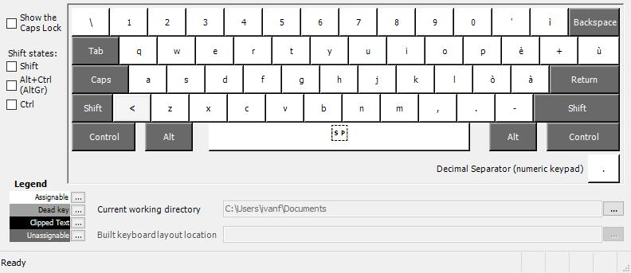
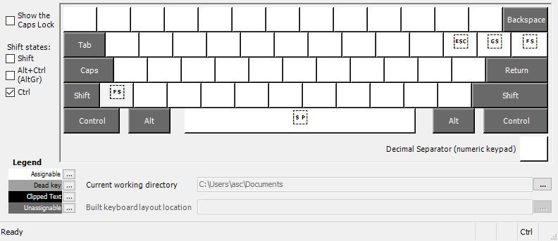
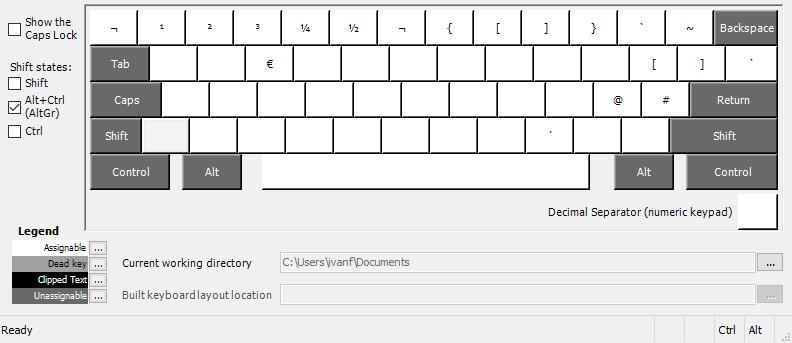

ITLinux
=======

An Italian keyboard layout for Windows, customized with Linux shortcuts.

  - `AltGr + '` types `
  - `AltGr + ì` types ~

## Pictures

### Default

### Shift

### Ctrl

### AltGr

## Installation

Build from sources using [MSKLC](https://www.microsoft.com/en-us/download/details.aspx?id=102134) tool or download and install the previously built version.

### Without Administrator rights

You can use this layout without Administrator rights by using [PKL](https://sourceforge.net/projects/pkl/):

- Download and extract PKL
- Create the `itlinux` folder into the `layouts` folder
- Download the [layout.ini](pkl/layout.ini) file and put it into the `layouts\itlinux` folder
- Configure PKL to use this layout by editing `pkl.ini`:

     layout = itlinux:ITLinux

- Run pkl.exe

## Why

Current [Italian keyboard layout](https://docs.microsoft.com/en-us/globalization/keyboards/kbdit.html) for Windows does not allow a method to easily (one-shot) type tilde and backtick.

[Italian (142) keyboard layout](https://docs.microsoft.com/en-us/globalization/keyboards/kbdit142.html) instead, breaks common used shortcuts to get curly and square brackets.

## Donate

Donations via [Liberapay](https://liberapay.com/ilpianista) or Bitcoin (1Ph3hFEoQaD4PK6MhL3kBNNh9FZFBfisEH) are always welcomed, _thank you_!

## License

MIT
